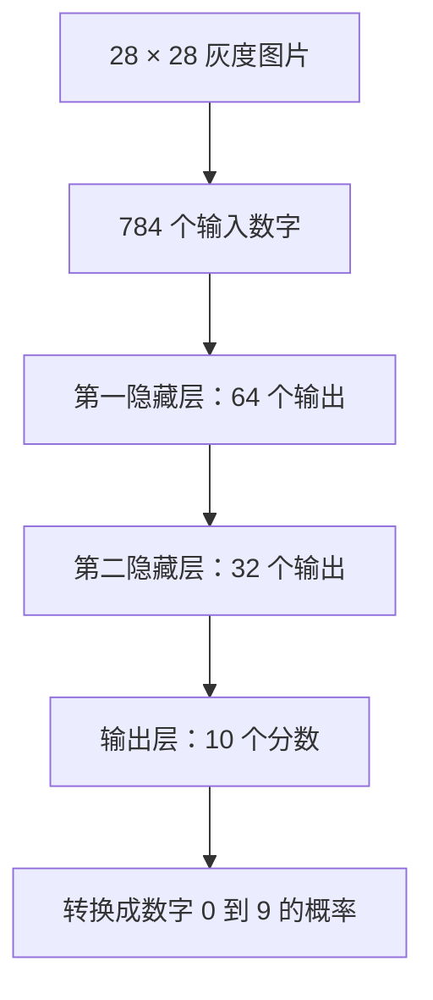
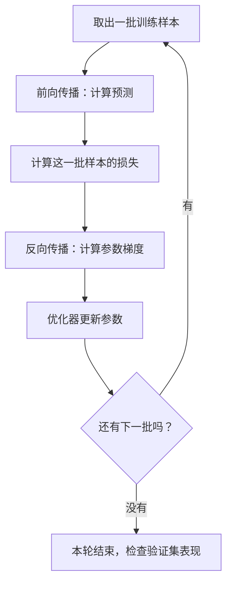
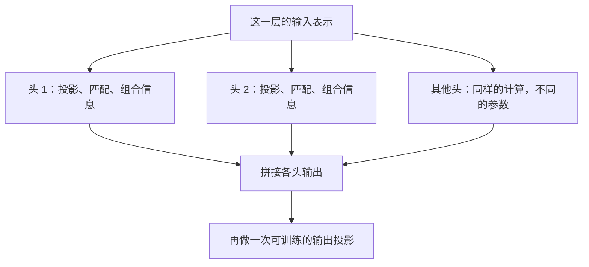
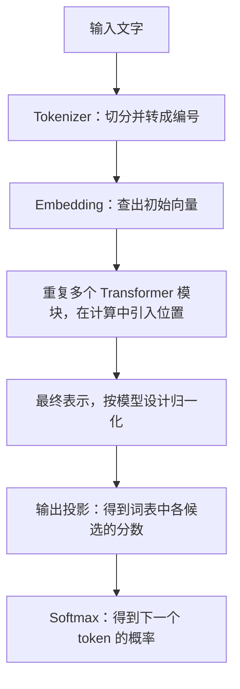
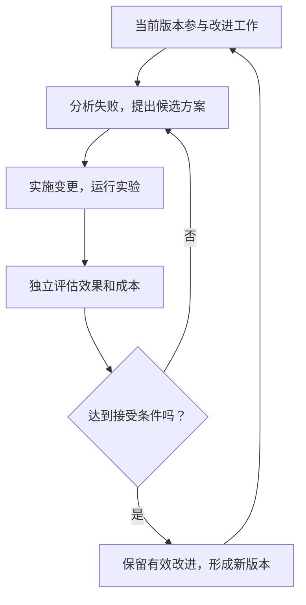

# 从神经元到 Transformer、GPT 与 RSI：一步一步理解 AI

这篇教程面向没有机器学习基础的读者。我们从几个数字的乘法和加法开始，逐步解释神经网络怎样计算、训练怎样改变参数、Transformer 怎样利用上下文、GPT 怎样生成回答，以及 AI 怎样参与改进自身。教程也解释上下文限制与这些系统的能力边界。

文中的 **RSI** 指 **Recursive Self-Improvement，递归自我改进**。它属于 AI 研究话题，与金融行情里的相对强弱指数不是同一个概念。

所有手算例子都是为了说明原理构造的。它们可以复算，但不代表某个真实大模型的内部数值。研究案例的一手资料核对日期为 **2026-10-08**。

## 阅读路线

1. [先把几个概念放到正确的位置](#concept-map)
2. [一个神经元究竟怎样计算](#neuron)
3. [很多神经元怎样组成网络](#network)
4. [完整算一遍训练和反向传播](#training)
5. [推理怎样使用训练好的模型](#inference)
6. [Transformer 要解决什么问题](#transformer)
7. [完整算一遍注意力机制](#attention)
8. [把 Transformer 的其他部件装起来](#transformer-block)
9. [语言模型与 GPT 怎样训练和生成文字](#language-model)
10. [Transformer 的上下文为什么有上限](#context-limits)
11. [RSI 怎样形成自我改进循环](#rsi)
12. [目前 Transformer 配合 RSI 仍有哪些局限](#transformer-rsi-limits)
13. [常见误解与自测](#review)
14. [一手资料与延伸阅读](#references)

GPT 专题可直接从 [第 9.11 节](#gpt) 开始；它的独立局限性见 [第 9.19 节](#gpt-limits)。第一次阅读建议先学完神经网络和注意力的算例。

<a id="concept-map"></a>

## 1. 先把几个概念放到正确的位置

### 1.1 用“做题”建立第一印象

想象一名学生学习识别手写数字。

老师给他看很多图片，并告诉他：“这张是 7，那张是 1。”他先试着判断，再对照答案，逐渐改变自己的判断方法。后来遇到一张从没见过的图片，他用学到的方法给出答案。

把这个过程对应到机器学习：

| 概念 | 在做什么 | 对应的直观印象 |
| --- | --- | --- |
| 数据 | 提供输入和学习材料 | 练习题、答案和其他资料 |
| 神经网络 | 按一定结构把输入算成输出 | 学生使用的计算方法 |
| 参数 | 控制计算中的各种关系 | 方法里许多可调整的数字 |
| 训练 | 根据反馈调整参数 | 做题、对答案、改进方法 |
| 推理 | 用当前参数计算输出 | 用学过的方法做一道新题 |
| Transformer | 组织神经网络中的计算 | 一种特别适合处理上下文的结构 |
| GPT | 基于生成式预训练 Transformer 思路的模型 | 先从大量材料学习，再根据输入生成内容 |
| RSI | 让 AI 参与改进系统及其改进过程 | 学会研究自己的学习方法 |

学生的类比只帮助我们理解流程。机器实际执行的是数字运算，这个类比不能用来推断机器具有人的感受或意识。

### 1.2 它们处在不同层次

**神经网络是计算模型，Transformer 是其中一种架构，训练和推理是使用模型的两个过程，RSI 则是改进 AI 系统的一种循环。**

例如，一个采用 Transformer 架构的语言模型，需要先训练，再运行推理；一个 RSI 系统可以调用这个模型，设计实验、修改程序，尝试改进整个 AI 系统。

因此，知道“它用了 Transformer”，还不能说明它如何训练，更不能说明它已经实现了 RSI。

<a id="neuron"></a>

## 2. 一个神经元究竟怎样计算

### 2.1 先把现实信息变成数字

计算机需要能参与运算的输入。

- 图片可以表示为像素的亮度或颜色数值。
- 声音可以表示为按时间采样的数值，或由这些数值计算出的特征。
- 文字先拆成 token，再转成编号和向量。后面会详细解释。

例如，一张 28 × 28 的灰度图片，可以用 784 个亮度数字表示。为了方便计算，可以把亮度缩放到 0 到 1 之间。

这些数字本身不会自动告诉计算机“这是 7”。网络要学会怎样组合它们，才能做出判断。

### 2.2 一个神经元是一个小计算单元

先看只有两个输入的情况：

```text
输入：x1、x2
权重：w1、w2
偏置：b

先计算：z = x1 × w1 + x2 × w2 + b
再计算：输出 = 激活函数(z)
```

逐项解释：

- `x1、x2` 是这一次收到的输入。
- `w1、w2` 控制输入对结果的影响方向和强度，是可以训练的参数。
- `b` 是偏置，也是可以训练的参数，它允许整体调整计算结果。
- `z` 是本次计算的中间结果。
- 激活函数对 `z` 做进一步转换。

把权重理解成“旋钮”很方便，但不要直接认为绝对值最大的权重对应最重要的信息。输入的尺度、其他权重和后续运算都会影响最终结果。

### 2.3 代入数字，实际算一次

设定：

```text
x1 = 0.8
x2 = 0.3
w1 = 1.5
w2 = -1
b  = -0.4
```

先乘，再加：

```text
x1 × w1 = 0.8 × 1.5 = 1.2
x2 × w2 = 0.3 × (-1) = -0.3

z = 1.2 - 0.3 - 0.4 = 0.5
```

这里，第一路输入把结果往上推，第二路输入因为权重为负，把结果往下拉。

再使用一种简单的激活函数 **ReLU**：

```text
ReLU(z) = z 与 0 中较大的一个

ReLU(0.5) = 0.5
ReLU(-0.5) = 0
```

所以，这个神经元在本次输入下的输出是 `0.5`。

### 2.4 激活函数为什么必不可少

先想象没有任何非线性转换的两层计算：

```text
第一层：h = 2x + 1
第二层：y = 3h + 4

代入后：y = 3 × (2x + 1) + 4 = 6x + 7
```

两层可以合并成一层。即使每层有很多输入和输出，只要全是这种线性加偏置的运算，叠起来仍能合并。

ReLU 加入了一处“折点”：负数区域输出零，正数区域输出原值。类似的非线性转换，使网络能根据输入所在的区域采用不同的计算关系。

**层层组合这些非线性关系，网络才能表达复杂的输入与输出关系。** 激活函数有多种，ReLU 只是便于手算的一种。[Google 激活函数教程][activation]

### 2.5 一个容易忽略的区别

| 数字 | 随什么改变 | 通常是否保存为模型参数 |
| --- | --- | --- |
| 输入 `x` | 换一道题就可能改变 | 否 |
| 权重 `w`、偏置 `b` | 训练更新时改变 | 是 |
| 中间结果 `z`、输出 | 换输入或换参数就可能改变 | 否 |

后面看到 embedding、Q、K、V、注意力权重时，也要不断问：**这是长期保存的参数，还是当前输入产生的计算结果？**

<a id="network"></a>

## 3. 很多神经元怎样组成网络

### 3.1 一层是许多计算单元一起处理输入

假设一层有 64 个神经元。它们可以接收相同的输入，但各自拥有不同的权重和偏置，所以算出 64 个不同结果。

这 64 个结果组成一串数字，再交给下一层。

前一层的输出，就是后一层的输入。整个网络是多次计算的组合。

### 3.2 用识别手写数字的网络举例

设计一个简单的全连接网络：



“全连接”表示：这一层的每个计算单元，都可以使用上一层的全部输出。

“隐藏层”中的“隐藏”，是说这些结果位于输入和最终输出之间，通常没有直接给它们提供“这一项应该是多少”的标签。它们仍然可以被程序读取和检查。

### 3.3 每一层学到什么

处理图像时，网络中的一些特征可能与线条、局部形状或更复杂的组合有关。前面的计算提供基础信息，后面的计算利用它们形成进一步的表示。

为了入门，可以把过程想成“像素 → 笔画 → 形状 → 数字”。但实际网络并没有保证“第一层只管笔画，第二层只管形状”。一个概念也可能分散在很多单元中。

**特征的作用主要由训练形成。** 人设计结构和目标，训练寻找能帮助完成任务的参数。

### 3.4 一串数字、一个矩阵、一个张量分别是什么

- 一个数字，叫标量，例如某个像素的亮度。
- 一串数字，叫向量，例如某一层的 64 个输出。
- 一张数字表，叫矩阵，例如一层连接各个输入与输出的权重表。
- 张量是更一般的数字数组，可以有一维、二维或更多维。

把很多神经元的加权求和合在一起，可以写成矩阵乘法。矩阵形式没有改变原理，只是让计算更适合批量执行。

这也是 GPU 有用的原因之一：它擅长同时处理大量相似的数值运算。小网络也可以在 CPU 上训练和运行。

### 3.5 参数数量怎么算

对于刚才的网络，假设每个输出单元都有一个偏置：

| 连接 | 权重数量 | 偏置数量 | 合计 |
| --- | ---: | ---: | ---: |
| 784 个输入到 64 个单元 | 784 × 64 = 50,176 | 64 | 50,240 |
| 64 个输入到 32 个单元 | 64 × 32 = 2,048 | 32 | 2,080 |
| 32 个输入到 10 个输出 | 32 × 10 = 320 | 10 | 330 |
| 总计 | 52,544 | 106 | **52,650** |

这台小机器有 52,650 个可训练的数字。“参数量”统计的是这类数字的数量，并不等于神经元数量、知识条目数量或智力水平。

### 3.6 非线性怎样解决一个简单难题

看一个规则：两个输入都是 0 或 1；它们相同时输出 0，不同时输出 1。这叫 **异或，XOR**。

用两个隐藏单元就可以构造：

```text
h1 = ReLU(x1 - x2)
h2 = ReLU(x2 - x1)
y  = h1 + h2
```

逐项计算：

| `x1` | `x2` | `h1` | `h2` | 输出 `y` |
| ---: | ---: | ---: | ---: | ---: |
| 0 | 0 | 0 | 0 | 0 |
| 0 | 1 | 0 | 1 | 1 |
| 1 | 0 | 1 | 0 | 1 |
| 1 | 1 | 0 | 0 | 0 |

为什么简单的加权求和做不到这个精确映射？设它为 `y = ax1 + bx2 + c`。第一个样本要求 `c = 0`；第二、第三个要求 `b = 1、a = 1`；那么第四个就得到 2，与要求的 0 冲突。

这个例子的参数是我们手工选的，用来展示网络的表达能力。训练要解决的下一步问题是：**参数应该怎样自动找到？**

<a id="training"></a>

## 4. 完整算一遍训练和反向传播

### 4.1 训练需要一个目标

训练不是把资料放进去就自动完成。系统需要一个可以计算的目标或反馈，才能判断参数变化有没有帮助。

- 识别数字：预测的类别与正确标签是否一致。
- 预测数值：预测值与目标数值相差多远。
- 预测文字：模型给原文中下一个 token 分配了多大概率。
- 强化学习：根据环境反馈的奖励，优化某种行为策略。

先用数值预测讲清反向传播。这里的目标是：收到输入 `2` 时，输出尽量接近 `6`。

### 4.2 设定一个足够小的网络

这个网络包含一个隐藏单元和一个输出单元：

```text
z    = w1 × x + b1
h    = ReLU(z)
预测 = w2 × h + b2
```

输出层直接给出一个数，不再使用 ReLU。不同任务的输出层可以采用不同设计。

设初始参数为：

```text
x = 2，正确答案 = 6

w1 = 1，b1 = 0
w2 = 2，b2 = 0
```

真实网络常用经过设计的随机方式初始化权重；偏置可以初始化为零。若同一层的单元从完全相同的状态开始，往往也会收到相同的更新，难以学出不同作用。

这里把初始值固定，只是为了让每一步都能手算。

### 4.3 第一步：前向传播，先做一次预测

```text
z = 1 × 2 + 0 = 2
h = ReLU(2) = 2
预测 = 2 × 2 + 0 = 4
```

正确答案是 6，目前预测是 4。

前向传播就是按网络的连接顺序，把输入一步步算成输出。此时还没有调整参数。

### 4.4 第二步：把“错得多严重”变成一个数字

采用一个简单的损失函数：

```text
误差 = 预测 - 正确答案
损失 L = 0.5 × 误差²
```

本例中：

```text
误差 = 4 - 6 = -2
L = 0.5 × (-2)² = 2
```

平方让正负误差都产生非负损失，而且较大的误差会得到更大的惩罚。乘以 0.5 是为了让接下来的变化率计算更简洁。

这个损失只适合解释本例。真实任务要选择相应的损失函数。

### 4.5 第三步：理解梯度到底在问什么

假设只把 `w2` 从 `2` 增加到 `2.001`，其他参数保持原样：

```text
新预测 = 2.001 × 2 = 4.002
新损失 = 0.5 × (4.002 - 6)² = 1.996002

参数增加了 0.001
损失减少了 0.003998

损失变化 ÷ 参数变化 = -3.998
```

如果增加量继续缩小，这个比值趋近 `-4`。

这就是本次计算中损失对 `w2` 的梯度：**在当前状态附近，稍微增大 `w2` 会让损失下降，下降的敏感程度约为 4。**

梯度是局部变化率，不是一次改动后效果的无限保证。一次改得太多，仍可能越过合适位置，让损失上升。

### 4.6 第四步：从输出往回算

下面使用 `dL/dw` 这样的记号，表示“只改变参数 `w` 时，损失 `L` 的变化率”。它不是把两个普通数字直接相除。

**先算损失对预测的敏感程度。**

对于 `L = 0.5 × (预测 - 答案)²`，这个变化率是 `预测 - 答案`，所以：

```text
dL/d预测 = 4 - 6 = -2
```

为什么会得到这个结果？假设预测增加一个很小的数 `δ`，展开平方后，损失的变化为：

```text
损失变化 = 原来的误差 × δ + 0.5 × δ²
```

当 `δ` 很小时，除以 `δ` 后，后面的 `0.5 × δ` 趋近零，剩下的就是原来的误差。

**再算输出层参数的梯度。**

预测公式是 `预测 = w2 × h + b2`。

- `w2` 增加一点，预测的增加量是这一点乘以 `h`。
- `b2` 增加一点，预测就增加同样的一点。

沿着这两条关系计算：

```text
dL/dw2 = dL/d预测 × h = (-2) × 2 = -4
dL/db2 = dL/d预测 × 1 = -2
```

**然后继续传回隐藏层。**

`h` 增加一点，预测的增加量是这一点乘以 `w2`：

```text
dL/dh = dL/d预测 × w2 = (-2) × 2 = -4
```

本次 `z = 2 > 0`，ReLU 在这一段直接输出原值，所以 `h` 对 `z` 的变化率是 1：

```text
dL/dz = dL/dh × 1 = -4
```

最后，`z = w1 × x + b1`：

```text
dL/dw1 = dL/dz × x = (-4) × 2 = -8
dL/db1 = dL/dz × 1 = -4
```

### 4.7 为什么沿途的变化率可以相乘

直接观察 `w1` 的一小点变化：

```text
w1 增加 0.001
  → z 增加 0.002，因为 x = 2
  → h 增加 0.002，因为本次 ReLU 处于正数区域
  → 预测增加 0.004，因为 w2 = 2
  → 损失大约减少 0.008，因为当前误差是 -2
```

每一段把变化放大或缩小，再把影响传到下一段。把这些敏感程度相乘，就得到完整路径的影响。这就是求导中的**链式法则**。

在复杂网络中，一个参数可能通过多条路径影响损失，各条路径的影响还要相加。

**反向传播利用这些局部关系，从损失沿计算图往回算，高效求出参数的梯度。** 它不需要逐个参数重新运行整个网络试探。PyTorch 等框架能通过自动求导完成这件事。[PyTorch 自动求导教程][autograd]

### 4.8 第五步：优化器使用梯度更新参数

采用最简单的梯度下降，设学习率为 `0.01`：

```text
新参数 = 旧参数 - 学习率 × 梯度
```

为什么是减号？梯度指向局部让损失增大的方向，沿相反方向移动是在尝试降低损失。

| 参数 | 旧值 | 本次梯度 | 新值 |
| --- | ---: | ---: | ---: |
| `w1` | 1 | -8 | 1.08 |
| `b1` | 0 | -4 | 0.04 |
| `w2` | 2 | -4 | 2.04 |
| `b2` | 0 | -2 | 0.02 |

这四个梯度都来自同一次、使用旧参数的前向计算。计算完本次梯度后，再完成这一次更新。

**反向传播负责算梯度，优化器负责决定怎样更新参数。** 本例采用简单的梯度下降；Adam 等优化器还会利用历史梯度统计来调整更新方式。[PyTorch 参数优化教程][optimization]

### 4.9 第六步：用新参数再算一次

```text
z = 1.08 × 2 + 0.04 = 2.2
h = ReLU(2.2) = 2.2
预测 = 2.04 × 2.2 + 0.02 = 4.508

误差 = 4.508 - 6 = -1.492
新损失 = 0.5 × (-1.492)² = 1.113032
```

损失从 `2` 降到了约 `1.113`，预测从 `4` 向 `6` 靠近。

这就是一次完整更新的结果。它只说明本样本的损失下降了，不能证明模型已经学会所有输入上的规律。

### 4.10 把单次更新扩展到整个数据集

真实训练会使用许多样本，通常按一批一批处理：



| 术语 | 含义 |
| --- | --- |
| Batch | 一批同时处理的样本 |
| Batch size | 这一批包含多少样本 |
| Step | 在这里指完成一次优化器参数更新 |
| Epoch | 把训练数据完整遍历一遍 |
| 学习率 | 控制一次更新的步长尺度 |
| 超参数 | 人或外部搜索过程设置的配置，例如学习率、批大小 |

例如，有 1,000 个样本，每批 100 个，在没有其他处理的简化情况下，一轮有 10 批，也就有 10 次更新。

一批样本的平均损失会综合不同样本的反馈。有时某个样本希望参数增加，另一个希望减少，最后更新的是综合后的方向。

实际工程也可以先累积几批梯度再更新一次。因此，看训练日志时要确认 step 的具体定义。

### 4.11 怎么知道模型学到了规律

通常把数据按用途分开：

- **训练集**：用于计算梯度和更新参数。
- **验证集**：用于比较配置、选择模型和决定是否停止训练。
- **测试集**：在最终方案确定后，用于评估对未见样本的表现。

这些数据需要按任务合理划分，避免同一对象、重复内容或未来信息跨集合泄漏。

训练集越来越好，验证集反而变差，常常提示**过拟合**。网络可能学到了训练样本中特有的细节，对新样本帮助不大。

学习目标是**泛化**：在没有参与训练的新样本上，也能做出有用的预测。持续根据测试集成绩调方案，会削弱它作为独立检验的作用。[Google 数据划分教程][datasets]

<a id="inference"></a>

## 5. 推理怎样使用训练好的模型

### 5.1 保存的究竟是什么

运行模型通常需要网络结构的配置，以及学到的参数。语言模型还需要相配套的 tokenizer 等信息。

若要继续训练，检查点还可能保存优化器状态、训练步数等内容。但普通推理不必使用优化器来更新参数。

训练样本中的规律，主要通过参数影响模型的行为。参数不像数据库里的“问题 → 答案”表，不过模型也可能记住部分训练内容，不能把泛化与记忆简单二选一。

### 5.2 新输入怎样得到答案

用手写数字识别举例：

1. 加载网络配置和训练好的参数。
2. 把新图片处理成与训练时相符的输入格式和数值尺度。
3. 进行前向传播，得到 10 个类别分数。
4. 按需要把分数转成概率。
5. 选择类别或执行后续处理。

假设输出概率最高的类别是 7，就可以报告“预测为 7”。但模型给出的概率不一定经过良好校准，不能直接当作客观正确率保证。

### 5.3 训练与推理的区别

| 项目 | 典型训练 | 普通推理 |
| --- | --- | --- |
| 主要目标 | 根据学习反馈改进参数 | 根据当前参数计算输出 |
| 前向传播 | 需要 | 需要 |
| 损失或学习反馈 | 需要 | 生成输出时通常不需要 |
| 反向传播 | 基于梯度的训练需要 | 通常不需要 |
| 参数更新 | 需要 | 通常保持不变 |
| 中间结果 | 随输入和参数变化 | 随输入变化 |

推理阶段也可以计算损失来评估模型，但计算评估指标本身不等于训练。这里讨论的是通常的训练与推理流程；专门的在线学习等系统会另外安排更新机制。

### 5.4 为什么回答变了，不代表参数变了

你先问“苹果是什么”，再补充“我说的是手机公司”，模型的回答可能立刻改变。

这是因为新输入改变了中间计算。普通推理中的参数可以完全相同。

记住这个关系：

```text
输出 = 使用当前参数，对当前输入执行计算
```

输入变了，输出就可能变。产品保存聊天记录或用户偏好，也可以影响之后提供给模型的输入，仍不必改动模型参数。

### 5.5 推理为什么仍然需要算力和内存

参数不变，不等于不用计算。每次运行仍要进行矩阵乘法、激活函数和其他运算。

只做一个存储量算例：70 亿个参数，每个占 2 字节，则仅参数约占 `140 亿字节`，也就是约 `14 GB`，这里按十进制计算。

实际运行还要存放中间结果、缓存和工作空间；训练还可能存放梯度、优化器状态等。因此，参数文件大小不能直接等同于运行时所需内存。

<a id="transformer"></a>

## 6. Transformer 要解决什么问题

### 6.1 文字的含义与上下文有关

看两句话：

```text
我吃了一个苹果。
苹果发布了一款手机。
```

“苹果”的表面形式相同，但与周围内容结合后，含义不同。

还有指代：

```text
小明拿起苹果，吃掉了它。
```

“它”与前面的“苹果”有关。更长的文章中，需要关联的信息可能隔着许多句子。

因此，一个位置的表示不能只依赖这个位置的 token，还需要利用相关上下文。

### 6.2 RNN 的思路：把信息一步步传下去

循环神经网络 RNN 的基本处理方式可以概括为：

```text
读第一个 token → 更新状态
读第二个 token → 根据旧状态继续更新
读第三个 token → 再更新
```

之前的信息被压进不断更新的状态。某个位置的计算需要之前的状态，所以沿序列方向存在逐步依赖。

这种方法可以处理序列，但在长距离信息传递、训练稳定性和同一条序列的并行计算上会遇到困难。LSTM 等结构做了改进，这些困难也不能简单描述为“过了固定长度就完全失效”。

### 6.3 Transformer 的思路：直接计算位置之间的联系

Transformer 使用注意力，让一个位置直接从允许访问的其他位置获取信息。

它会计算各位置与当前位置的匹配分数，把分数转成比例，再按比例组合那些位置的信息。[Transformer 原始论文][transformer-paper]

“允许访问”很重要：阅读整段输入的编码器通常能参考这段输入的各个位置；逐步生成文字的因果语言模型只能参考当前及之前的位置。

### 6.4 Transformer 有几种常见组织方式

| 组织方式 | 基本结构 | 常见用途 |
| --- | --- | --- |
| 仅编码器 | 输入内部做上下文处理 | 文本表示、分类等 |
| 仅解码器 | 通过因果注意力逐步预测后续内容 | GPT 风格的文字生成 |
| 编码器加解码器 | 先处理输入，再结合输入生成输出 | 翻译等序列转换任务 |

原始 Transformer 是编码器加解码器的结构。后面重点讲常见的仅解码器语言模型，并标明它与原始结构的区别。

### 6.5 文字首先变成 token

**Token 是 tokenizer 拆出的基本片段。** 它可能是一个字、一个词、词的一部分、标点或其他片段，不能把 token 与汉字或单词固定一一对应。

为了手算，假设 tokenizer 把一句话拆成：

```text
我 / 喜欢 / 苹果
```

这只是本文的教学分词，不是某个真实模型的分词结果。

每个 token 在词表中对应一个编号。例如可以假定：

```text
我     → 12
喜欢   → 58
苹果   → 93
```

编号只用于查找对应条目。“苹果”的编号较大，不表示它比“我”更重要。[Hugging Face tokenizer 教程][tokenizer]

### 6.6 从编号到向量：embedding

模型中有一张可以训练的数字表，叫 **embedding 表**。用 token 编号选出对应的一行，就得到这个 token 的初始向量。

例如，手工设一个四维向量：

```text
苹果的初始向量 = [0.2, -0.5, 0.8, 0.1]
```

这里的“四维”，就是有四个坐标。真实模型通常使用更多坐标。

不要给每个坐标强行起名为“水果程度”“公司程度”。训练可能让信息分散在许多坐标及其组合中。

embedding 表中的数是参数；查表得到的当前向量是计算使用的表示。经过后续层后，同一个 token 在不同上下文里的表示可以不同。

### 6.7 怎么知道顺序

“我喜欢你”和“你喜欢我”含有相同的几个字，但顺序改变了关系。

因此，模型需要位置信息。原始 Transformer 把位置编码加到 token 向量中，使用不同频率的正弦和余弦产生这些编码。[Transformer 位置编码说明][transformer-paper]

另一种方法是 **RoPE，旋转位置编码**。它按照位置旋转 Query 和 Key 的某些坐标组合，让后续匹配分数受到相对位置的影响。[RoFormer 原始论文][rope]

共同目标是让计算利用顺序和距离。不同模型的具体做法不同，不能理解为所有模型都简单地把位置编号加到向量上；引入位置方法也不自动保证任意长上下文都能正确处理。

<a id="attention"></a>

## 7. 完整算一遍注意力机制

### 7.1 先说明注意力的输出是什么

注意力模块接收一组位置的向量，输出经过信息组合的新向量。

它的注意力比例，可以帮助理解“这次计算从各个位置取了多少信息”，但不是直接输出的文字概率，也不是天然可靠的人类解释。

先关注一个位置的一次、一个头的计算。

### 7.2 Q、K、V 的直观含义

用资料查询来类比：

- **Q，Query**：这次要找哪类信息。
- **K，Key**：每份资料提供什么特征，用来做匹配。
- **V，Value**：每份资料实际提供的内容。

这个类比对应的是：**用 Q 和 K 算匹配，再按匹配结果组合 V。**

在自注意力中，同一组输入表示分别经过三个可训练的变换，产生 Q、K、V。按每个位置写，可以理解为：

```text
当前输入向量 × WQ → 当前位置的 Q
当前输入向量 × WK → 当前位置的 K
当前输入向量 × WV → 当前位置的 V
```

`WQ、WK、WV` 是训练得到的参数矩阵。Q、K、V 是用这些参数对本次输入计算出来的向量。[Transformer 注意力定义][transformer-paper]

Q 里没有一段人类语言写着“找主语”，K 也不是人工填写的语法标签。它们的匹配方式通过训练形成。

### 7.3 准备一个完全可以手算的例子

假定当前位置的 Query 为：

```text
Q = [1, 0]
```

有三个允许参考的位置：

| 位置 | Key | Value |
| --- | --- | --- |
| A | `[0, 1]` | `[1, 0]` |
| B | `[1, 0]` | `[0, 2]` |
| C | `[2, 0]` | `[3, 1]` |

这些向量是手工设定的。我们这里只展示“给定 Q、K、V 后怎么算”，不把它们解释成真实模型对某几个词的判断。

### 7.4 第一步：Q 与每个 K 算点积

点积，就是对应坐标相乘，再加起来：

```text
[a, b] 与 [c, d] 的点积 = a × c + b × d
```

所以：

```text
A 的匹配分数 = 1 × 0 + 0 × 1 = 0
B 的匹配分数 = 1 × 1 + 0 × 0 = 1
C 的匹配分数 = 1 × 2 + 0 × 0 = 2
```

得到原始分数 `[0, 1, 2]`。在本例中，C 的匹配分数最高。

注意，点积分数也受向量长度影响，不能直接等同于已经归一化的“相似度百分比”。

### 7.5 第二步：按维度缩放

标准的缩放点积注意力，把分数除以 Key 维度的平方根。这里 Key 有两个坐标，所以除以 `sqrt(2)`：

```text
sqrt(2) ≈ 1.4142

缩放后分数 ≈ [0, 0.7071, 1.4142]
```

为什么这样做？在常见的数值分布假设下，维度越大，点积分数的波动可能越大。缩放有助于避免 softmax 太容易集中到一个位置，使训练中的梯度过小。

### 7.6 第三步：softmax 把分数变成比例

softmax 的算法是：先对每个分数计算指数，再除以这些指数的总和。

```text
某一项的比例 = exp(这一项分数) ÷ 所有项 exp(分数) 的总和
```

`exp(s)` 表示 `e` 的 `s` 次方，`e` 约为 2.718。它会把任意实数分数转换成正数，同时保留分数的大小顺序。

本例中：

```text
exp(0)      = 1
exp(0.7071) ≈ 2.0281
exp(1.4142) ≈ 4.1133

总和 ≈ 7.1414
```

再分别除以总和：

| 位置 | 注意力比例，四舍五入后 |
| --- | ---: |
| A | 0.1400，约 14.00% |
| B | 0.2840，约 28.40% |
| C | 0.5760，约 57.60% |

这些比例加起来约为 1；用未四舍五入的数计算，和为 1。实际实现常先减去本行最大分数，再求指数，以提高数值稳定性，比例不变。[PyTorch softmax 定义][softmax]

### 7.7 第四步：按这些比例组合 V

用刚才的比例计算加权和：

```text
输出向量 = 0.1400 × [1, 0]
         + 0.2840 × [0, 2]
         + 0.5760 × [3, 1]
```

分别计算两个坐标：

```text
第一坐标 ≈ 0.1400 × 1 + 0.2840 × 0 + 0.5760 × 3
         ≈ 1.8680

第二坐标 ≈ 0.1400 × 0 + 0.2840 × 2 + 0.5760 × 1
         ≈ 1.1440
```

因此输出约为 `[1.8680, 1.1440]`。

这一轮的变化是：当前位置根据 Q 与各个 K 的匹配，获取了三个位置的 V 的不同份额，形成一个新表示。

### 7.8 用一句公式把四步串起来

如果把许多位置的 Query、Key、Value 分别排成矩阵，可以写成：

```text
Attention(Q, K, V) = softmax(Q × K的转置 / sqrt(dk)) × V
```

逐步对应：

1. `Q × K的转置`：批量计算位置之间的点积。
2. `/ sqrt(dk)`：按 Key 的维度缩放。
3. `softmax`：逐行把分数变成比例。
4. `× V`：按这些比例批量组合各位置的信息。

矩阵写法只是把刚才的手算一起执行。每个 Query 都会得到自己的一组比例和输出向量。

### 7.9 注意力的“比例”与模型的“参数”不是一回事

| 项目 | 从哪里来 | 换上下文后通常怎样 |
| --- | --- | --- |
| `WQ、WK、WV` | 训练更新得到 | 普通推理中保持不变 |
| Q、K、V | 输入表示乘以对应参数矩阵 | 随输入表示变化 |
| 注意力比例 | Q、K 匹配后经过 softmax | 随当前匹配结果变化 |

**模型长期学到的是怎样进行匹配和加工；具体“这次该参考哪里”，由当前输入参与计算。**

这解释了同一个“苹果”，在谈水果和谈手机的句子里，为什么可以得到不同的上下文表示。

### 7.10 多头注意力怎样工作

单头只用一套 Q、K、V 变换。多头使用多套不同的参数变换，同时执行刚才那套过程：



这样，系统有机会同时学习不同的关系。有的头可能表现出对局部相邻位置、指代等关系的偏好。

但“头 1 专管语法，头 2 专管语义”只是教学类比，不能当作预设分工。头的参数和作用都通过训练形成。

自注意力中的 Q、K、V 来自同一组输入表示。编码器与解码器之间的交叉注意力，则通常让解码器提供 Q，让编码器的输出提供 K、V，用于结合原始输入生成结果。[Transformer 原始结构][transformer-paper]

<a id="transformer-block"></a>

## 8. 把 Transformer 的其他部件装起来

注意力只负责一部分计算。一个完整的 Transformer 还需要信息加工、信息保留和数值尺度调整等部件。

### 8.1 前馈网络：对每个位置进一步加工

注意力把不同位置的信息组合起来。**前馈网络，FFN，也常叫 MLP**，再对每个位置得到的向量分别加工。

一个基本形式是：

```text
向量 → 第一次线性变换 → 非线性激活 → 第二次线性变换
```

例如，可以把一个四维向量变换成八维，经过激活函数，再变回四维。中间维度较大，给信息组合提供更多空间；具体维度由架构设计决定。

同一层处理不同位置时使用同一套 FFN 参数，不同层通常有各自的参数。

可以先记住：**注意力在位置之间传递信息，FFN 对各位置的信息分别进行非线性加工。**

### 8.2 残差连接：保留输入，再加上本轮变化

如果每一层都把输入完全替换成新结果，很多层之后可能难以保留原有信息，也可能不容易训练。

残差连接采用：

```text
输出 = 原输入 + 模块计算出的结果
```

例如：

```text
原输入       = [1.0, 2.0]
模块计算结果 = [0.2, -0.1]
相加后       = [1.2, 1.9]
```

从这个角度看，模块可以学习“在现有表示上增加什么变化”。反向传播时，加法还提供了一条直接传递梯度的路径，有助于深层网络训练。

### 8.3 归一化：调整数值尺度

随着层层计算，各位置向量的数值尺度可能变化。**LayerNorm，层归一化**，常用于调整一个位置的特征向量。

其基本过程是：

1. 计算这些坐标的均值。
2. 从各坐标减去均值。
3. 除以根据方差得到的尺度，计算时加入一个小量以避免除零。
4. 再用可学习的缩放和偏移参数调整。

以 `[2, 4, 6]` 为例，均值是 4，中心化后为 `[-2, 0, 2]`；忽略那个很小的防除零量，再除以标准差，约得到 `[-1.225, 0, 1.225]`。

归一化帮助控制数值尺度，改善训练过程。它不会保证网络一定学会正确知识，也不是把所有不同特征改成同一个值。[PyTorch LayerNorm 定义][layernorm]

### 8.4 一个模块怎样组合

许多现代语言模型采用先归一化再进入子模块的形式，可以概括为：

```text
输入 x
  → 归一化
  → 因果多头自注意力
  → 与原输入 x 相加，得到 u
  → 对 u 归一化
  → 前馈网络
  → 与 u 相加，得到这一模块的输出
```

按公式写就是：

```text
u = x + Attention(Norm(x))
输出 = u + FFN(Norm(u))
```

这里省略了注意力内部的位置处理等细节，只画出模块的主干。

原始 Transformer 的归一化放在残差相加之后，顺序有所不同。具体模型还可能使用 RMSNorm、门控 FFN 等变体。因此，上面的组合说明一种常见形式，并不定义所有 Transformer。[Pre-LN 与 Post-LN 的研究][layernorm-paper]

### 8.5 多个模块堆起来以后发生什么

第一个模块使用初始表示计算上下文关系。下一个模块接收的是已经包含上下文信息的表示，再计算新的关系和加工结果。

例如，要理解“他把它放了回去”，可能需要结合前面的角色、物品、动作和位置。多层计算可以逐步组合这些线索。

每层不一定对应一个人类命名的推理步骤，层数更多也不保证效果一定更好。效果还取决于数据、结构、训练与任务。

### 8.6 从输入到文字概率的完整路径



要理解生成过程，还需要回答：**训练时它怎样知道答案？生成时它怎样逐步选出文字？**

<a id="language-model"></a>

## 9. 语言模型与 GPT 怎样训练和生成文字

### 9.1 一个基础学习任务：预测下一个 token

仍用教学分词：

```text
我 / 喜欢 / 苹果 / EOS
```

`EOS` 是本例设定的结束标记。真实模型对文本边界和特殊 token 的安排可能不同。

训练时，把输入与目标错开一个位置：

| 当前输入位置 | 此处允许利用的输入 | 要预测的目标 |
| --- | --- | --- |
| 我 | 我 | 喜欢 |
| 喜欢 | 我、喜欢 | 苹果 |
| 苹果 | 我、喜欢、苹果 | EOS |

原文直接提供了学习目标，所以不需要人给每个位置另外写答案。这是一种**自监督学习**。

### 9.2 训练时为什么不能偷看后面的答案

虽然整段文字已经放进计算机，但预测“苹果”的位置不能使用后面的“苹果”作为输入信息。

否则模型可能学会抄答案，却不能在生成时处理还没出现的内容。

因此，使用**因果遮罩，causal mask**，限制每个位置能参考的范围：

| 当前位置可以参考哪里 | 我 | 喜欢 | 苹果 |
| --- | --- | --- | --- |
| 我 | 可以 | 禁止 | 禁止 |
| 喜欢 | 可以 | 可以 | 禁止 |
| 苹果 | 可以 | 可以 | 可以 |

在注意力计算中，先把禁止位置的匹配分数设为负无穷，再做 softmax。这些位置的指数贡献为零，得到零注意力比例。

**位置 `t` 可以参考它自己与之前的位置；由这个位置的输出预测 `t + 1`。** 当前输入与预测目标错开了一个位置，所以“参考自身”不是偷看目标。[Transformer 因果遮罩定义][transformer-paper]

### 9.3 语言模型的损失怎样衡量错误

输出投影给词表里每个候选 token 一个分数，再转换成概率。训练希望正确的下一个 token 得到更高概率。

这些尚未归一化的分数常被称为 **logits**。它们是模型的计算结果，不是百分比，也不是对事实真实性的评分。

如果正确目标是“苹果”，设模型给它的概率为 `p`。常用的交叉熵损失，在这个单目标例子里可以写成：

```text
损失 = -ln(p)
```

`ln` 是自然对数。先看数值：

| 给正确目标的概率 `p` | 损失，约值 |
| ---: | ---: |
| 0.1 | 2.303 |
| 0.5 | 0.693 |
| 0.8 | 0.223 |
| 0.99 | 0.010 |

正确目标的概率越高，损失越小；模型越确信错误答案，正确目标的概率往往越低，惩罚也越大。

训练通常汇总许多位置上的损失，再进行反向传播。梯度会经过输出投影、FFN、注意力和 embedding 等计算，更新参与学习的参数。[PyTorch 交叉熵定义][crossentropy]

### 9.4 “预测下一个 token”为什么能学到许多能力

看几个例子：

```text
北京是中国的 ____
如果所有 A 都是 B，所有 B 都是 C，那么所有 A 都是 ____
一个程序报错后，文档中的解决办法是 ____
```

为了在大量文本里做好预测，模型需要利用语言结构、事实关系、代码模式和不同形式的推导。

基础任务虽然形式统一，但训练材料包含许多不同的问题。学习这些材料中的关系，可以形成能迁移到其他输入的能力。

这不表示模型具有完美的事实库或保证正确的逻辑引擎。预测目标与“每句话都真实、每次推导都有效”并不完全相同。[Google 大语言模型教程][llm]

### 9.5 预训练、微调、强化学习分别改进什么

| 阶段 | 典型材料或反馈 | 主要作用 |
| --- | --- | --- |
| 预训练 | 大量文本等材料 | 学习广泛的模式与表示 |
| 监督微调 | 任务输入与示范输出 | 让模型更适合遵循指令或完成特定任务 |
| 强化学习或其他偏好优化 | 奖励、偏好比较等反馈 | 优化希望出现的行为 |

不同系统不一定包含所有阶段，也不一定使用相同顺序和方法。这些阶段仍然需要具体目标、训练过程与评估。

例如，学会在回答里遵循格式要求，可以来自后续训练；产品也可以通过提示词、工具和程序进一步组织行为。[Google 微调与提示工程教程][finetuning]

### 9.6 为什么训练可以并行，生成却通常要逐步来

**训练时**，输入文字和目标 token 都已经存在。可以把不同位置的向量排成矩阵，在同一层一起计算，因果遮罩确保各位置只能利用合法前缀。

**生成时**，后面的 token 尚未确定。通常必须先选出一个 token，才能把它作为新的输入继续预测。

这不矛盾：训练利用已给定的序列计算许多学习目标；生成需要一步步形成那个序列。

并行也不是“所有层都同时完成”。后一层仍然需要前一层的结果。生成中的每一步，内部同样有大量并行数值计算。

### 9.7 实际生成一次回答

假设输入是“我喜欢”，教学分词仍为“我 / 喜欢”。

1. Tokenizer 把输入转成编号。
2. 模型处理这些位置，获得带有上下文信息的表示。
3. 使用最后一个输入位置的表示，计算下一个 token 的候选分数。
4. 转换成概率，再按生成策略选择一个 token，例如“苹果”。
5. 把选中的 token 接到输入后，得到“我 / 喜欢 / 苹果”。
6. 继续预测后续 token，直到满足结束条件或长度限制。
7. 把生成的 token 序列解码成文字。

这里描述的是通常的自回归生成主线。模型配置和工程实现可能使用其他加速方法，但后续内容仍需要满足相应的依赖关系。

### 9.8 为什么同一个问题可以生成不同回答

假设模型给下一个 token 的原始分数为：

```text
苹果：2
香蕉：1
EOS： 0
```

经过 softmax，概率约为：

```text
苹果：66.52%
香蕉：24.47%
EOS： 9.00%
```

不同策略可以从这个分布里做不同选择：

- **贪心选择**：取概率最高的候选。
- **采样**：按概率随机抽取，较低概率的候选也可能被选中。
- **温度**：在 softmax 前调整分数，较低温度通常使分布更集中，较高温度通常使分布更平坦。
- **Top-p 等策略**：限制可采样的候选范围。

如果第一步选出的 token 不同，下一步输入也不同，后续回答就可能进一步分开。这种差异不要求模型参数发生变化。[Hugging Face 生成策略文档][generation]

### 9.9 Prefill 和 Decode 是什么

语言模型推理常分为两个阶段：

- **Prefill**：处理已有的提示词，形成各层所需的表示和缓存，并得到第一个待生成 token 的分布。
- **Decode**：使用已经选出的 token，逐步计算下一个 token 的分布，继续生成。

Prefill 可以在每一层批量处理提示词的多个位置。普通逐 token 的 Decode 则不断重复“选出 token → 计算下一步”。

提示词很长时，Prefill 可能需要较多时间；回答很长时，需要更多 Decode 步骤。[Hugging Face 缓存说明][cache]

### 9.10 KV cache 怎样减少重复计算

在适用的因果 Transformer 中，已经处理过的历史位置不会从未来位置获取信息。因此，在参数和已有前缀保持一致的前提下，后面追加 token 时可以复用历史位置在各层计算出的 K、V。

**KV cache 就是保存这些 Key 和 Value。**

生成新 token 时：

1. 为新的输入位置计算本层的 Q、K、V。
2. 把新 K、V 与已有缓存一起用于注意力计算。
3. 用新 Q 与允许参考的历史及当前 K 匹配。
4. 根据比例组合对应的 V，继续完成本层计算。
5. 在后续层执行相应过程，并保留新 K、V 供之后使用。

这样可以避免每一步都从头重算历史位置的许多结果。新位置与历史信息的匹配和组合仍然需要计算。

KV cache 保存的是当前上下文的中间结果，不是新的模型权重，也不自动成为跨对话长期记忆。常规完整缓存通常随上下文长度增长，占用更多内存；实际还有滑动窗口等缓存策略。[Hugging Face KV cache 原理][cache]

<a id="gpt"></a>

### 9.11 GPT 是什么，与 Transformer、ChatGPT 有什么关系

**GPT** 是 **Generative Pre-trained Transformer** 的缩写，可以拆开理解：

| 部分 | 中文意思 | 对应的原理 |
| --- | --- | --- |
| Generative | 生成式 | 根据输入产生后续内容 |
| Pre-trained | 预训练的 | 先通过大量材料训练，获得可用于多种任务的能力 |
| Transformer | Transformer 架构 | 采用基于注意力等模块的计算结构 |

OpenAI 官方文档使用这个名称介绍其生成式文本模型。[OpenAI 官方概念说明][openai-concepts]

三者的关系可以这样摆放：

- **Transformer** 是一类神经网络架构。
- **GPT** 是采用生成式预训练 Transformer 思路的一类模型，OpenAI 的相应模型系列也使用这个名称。
- **ChatGPT** 是对话产品，除了模型，还包含对话管理、界面以及按产品配置提供的工具等系统功能。[OpenAI 的 ChatGPT 使用介绍][openai-chatgpt]

本节用**经典 GPT 式因果文本模型**解释主干原理。现代商业模型还可能包含多模态输入、不同的模块和训练阶段，公开资料未披露的层数、参数组织与训练配方，不能由名字直接推断。

### 9.12 GPT 的文本主干怎样组织计算

经典 GPT 式文本模型采用仅解码器的因果 Transformer。它主要根据已有前缀预测后续内容，不需要先运行原始翻译架构中的独立文本编码器。

主干可以写成：

```text
已有文字
  → token 编号
  → embedding 向量
  → 多层因果 Transformer，在计算中使用位置信息
  → 最后一个输入位置的上下文表示
  → 输出投影
  → 词表里下一个 token 的概率
  → 选出一个 token
  → 把它追加到前缀，继续预测
```

每层的注意力能参考当前及之前的位置，不能借助尚未出现的未来内容。前面的 Q/K/V、FFN、残差和归一化，都是这里的具体计算部件。

例如，当前前缀是“请解释神经网络”，模型首先处理这整个输入，再预测助手回答中的第一个 token。之后每次新选择都会进入下一步的前缀。

### 9.13 它预测的是“在当前上下文下接什么”

不要把这个过程理解成只统计“某个词后面最常出现哪个词”。模型使用的是可见前缀经过多层计算后的表示。

可以用条件概率表达：

```text
下一个 token 的概率 = P(下一个 token | 当前可见前缀)
```

竖线右边表示“已经给定的条件”。改变前面的条件，就可能改变下一个 token 的分布。

例如，“苹果推出新手机”和“苹果切成小块”需要的后续内容不同。前缀中的关系通过注意力和其他模块参与计算。

一段回答的生成，也可以拆成这样的条件序列：

```text
先根据问题选第 1 个 token
再根据问题和第 1 个 token，选第 2 个
再根据问题和前 2 个 token，选第 3 个
……
```

这种分解叫**自回归生成**。它没有要求模型只能复制训练原句；训练形成的表示可以组合并用于新的输入，但新输入上的正确性仍需验证。

### 9.14 为什么 GPT 能像在“聊天”

一个基础语言模型可能只擅长续写文字。要成为聊天助手，还需要让它学会：哪些内容是要求、哪些是问题、哪里开始回答、怎样遵循格式与任务约束。

聊天接口会提供消息角色与内容。用一个示意格式表示：

```text
[系统或开发者要求]
使用中文，解释时先讲概念，再给例子。

[用户消息]
什么是神经网络？

[助手回答开始]
```

这些方括号是教学标记，不是实际 API 参数、固定特殊 token 或某个模型的真实内部格式。

系统把带有角色等结构的信息提供给模型，模型生成接下来的助手输出。相关训练让模型更适合这种任务；角色也用于表达指令的来源与优先关系，但遵循要求的实际效果仍需要评估。[OpenAI 文本生成与消息角色说明][openai-text]

多轮聊天时，需要继续提供或由服务维护有关历史状态。用户看见的是连续对话，模型使用的是本轮实际可访问的输入和状态。[OpenAI 对话状态说明][openai-state]

### 9.15 从预训练到助手训练，目标怎样变化

可以把一个典型流程理解为三个层次，而不是所有型号统一采用的固定配方：

1. **先学习广泛模式**：用大量材料训练生成任务，形成语言、知识与代码等方面的表示。
2. **再学习任务示范**：用指令与示范回答，调整参数，使模型更适合按照问题完成任务。
3. **再利用质量反馈**：使用偏好、奖励或其他反馈，改善回答质量、约束遵循及特定能力。

第二层可以想成看老师怎样答题，第三层可以想成对不同答法做比较。但机器仍然根据具体损失或优化目标进行参数更新。

原文里的下一个 token，不一定就是最适合助手输出的内容。后续训练尝试让回答更符合目标行为，但奖励或偏好指标也需要检验是否代表真正的正确与有用。[OpenAI 模型优化流程][openai-optimization]

### 9.16 给它几个例子，为什么不用重新训练也可能学会做这次任务

例如，在输入里提供：

```text
把句子改得更简短：
例子 1：由于今天出现了下雨的情况 → 今天下雨了
例子 2：我目前正在进行学习 → 我正在学习

现在处理：他在这个时间点还没有到达
```

模型可以利用示范中的对应关系，在本次上下文中生成“他现在还没到”等输出。

这常被称为**上下文学习，in-context learning**。对于普通推理，示范改变输入和中间表示，没有运行反向传播来更新权重。[OpenAI 示例提示方法][openai-prompting]

把例子移出可访问的上下文后，不能仅凭这次成功就断言模型参数永久学到了这条规则。

### 9.17 “多想一会儿”怎样帮助，为什么仍可能错

有些模型在最终回答前及任务执行过程中，会使用额外的推理计算或内部推理 token，用于拆解问题、考虑方案与检查步骤。它们仍属于推理计算，不是自动重新训练参数；也会占用上下文与相应输出预算，不能只统计屏幕上可见的回答文字。[OpenAI 推理模型说明][openai-reasoning]

直观上，一道题如果允许先列条件、做中间计算、比较方案，通常比直接给第一个答案更有机会答对。

但每个中间步骤仍可能遗漏条件或算错；错误假设也可能被后续步骤继续使用。因此，增加推理预算能够提供更多计算机会，不能单独形成必然正确的保证。

更长的解释也不一定说明更好的推理。应当检查结论、可验证的推导和实际结果，而不只是输出长度。

### 9.18 GPT 怎样使用搜索、计算器和代码工具

基础模型生成工具调用请求，外部系统实际执行对应操作，再把结果提供给模型继续处理。

以算一个较复杂的数值为例：

```text
用户提出计算问题
  → 模型生成计算器调用请求
  → 程序调用计算器，得到数值结果
  → 结果回到模型的可访问输入中
  → 模型结合结果生成回答
```

模型生成“运行测试”几个字，不等于测试已经运行；生成了调用参数，也不等于外部操作已经成功。[OpenAI 工具调用流程][openai-tools]

所以，一个带工具的助手可以比单独的语言模型可靠地完成更多任务。实际结果由模型、工具、程序组织和验证共同决定。

<a id="gpt-limits"></a>

### 9.19 GPT 的局限性，需要按成因理解

**第一，生成目标不等于事实正确性检查。**

模型能生成非常像真实答案的内容，例如看起来合理却不存在的书名、来源或代码接口。这通常称为幻觉。生成某段文字的概率，与这段文字是否真实，是不同的问题。

后续训练与检索可以减少一些错误，但需要用与任务相符的评估检查准确性。[OpenAI 准确性优化说明][openai-accuracy]

**第二，学到的知识不会在普通推理中自动实时更新。**

参数来自已经完成的训练。外部世界发生新变化，不会自动把新事实写进这些参数。

可以通过当前输入、搜索或其他工具提供新资料，让模型分析新情况，但资料是否新鲜、可信，以及是否被正确使用，仍要检验。[OpenAI 检索与知识补充说明][openai-accuracy]

**第三，复杂推理可能在某一步失误。**

当任务需要精确处理许多条件、保持符号一致或完成长计算时，一个局部错误可能影响后续结果。

模型可以学到有用的推导模式，也可以利用工具检查，但仅凭解释流畅或推理很长，不能证明每一步有效。

**第四，输入范围与长期状态有限。**

历史内容需要进入本轮可访问的输入或状态。超出窗口、被截断、摘要遗漏或检索未命中的信息，可能影响回答。

产品保存的记录、外部记忆、模型参数与当前上下文要分别看。具体原因会在第 10 节逐步解释。[OpenAI 上下文管理说明][openai-state]

**第五，生成过程和训练分布都会影响稳定性。**

采样策略、提示内容及模型版本变化，可能造成不同输出。面对与训练经验差异较大的任务，效果也可能下降。

不能用一个成功例子代表完整能力，应在实际任务范围内检验重复运行和不同输入的表现。[OpenAI 文本生成评估建议][openai-text]

**第六，单独的模型输出不等于现实中的动作。**

如果没有工具和执行环境，模型无法仅靠生成文字完成文件修改、数据查询或实验运行。

即使有工具，也可能选错工具、传错参数或误读结果。需要检查实际执行结果，不能只看模型宣布“已完成”。

**第七，模型自我评价不自动成为独立验证。**

让模型检查自己的答案是有用的方法之一，但它可能重复原来的错误、接受错误前提，或给出不够准确的信心表达。

对于能客观验证的任务，应把可执行测试、原始资料或其他有效验证结果纳入判断。这也解释了后面 RSI 为什么需要可信评估。

概括起来：**GPT 擅长根据输入生成和组合信息，但知识更新、精确验证、长期状态与实际动作，需要结合具体训练、输入、工具和系统设计来完成。**

<a id="context-limits"></a>

## 10. Transformer 的上下文为什么有上限

### 10.1 上下文窗口是这次计算的“工作台”

可以把上下文窗口想象成一张工作台：这次要直接参考的内容，需要放到台面上。

在一个典型因果语言模型的计算中，上下文是当前提供的 token 序列。它可以包含系统要求、用户问题、被保留的聊天记录、检索资料、工具结果，以及已经生成的内容。

工作台之外的内容，可能还在数据库、磁盘或聊天产品的存储中，但不会仅因为“已经保存”就自动参与本次模型计算。

上下文窗口大小按 token 统计，不能直接当作汉字数量。它也不是“模型一生能知道多少知识”的上限：参数中学到的规律与本次直接提供的上下文，是两种不同的信息来源。

### 10.2 先区分两个不同的“上限”

| 概念 | 在问什么 | 可能出现的现象 |
| --- | --- | --- |
| 配置或服务允许的最大窗口 | 一次最多允许处理多少 token | 超过后报错、截断或由应用重新组织输入 |
| 能够有效利用的上下文范围 | 内容提供后，模型是否能可靠利用 | 输入被接受，但遗漏远处事实或混淆多个条件 |

前者是可运行范围，后者是能力表现。**能够放进去，并不保证能够正确用起来。**

Transformer 没有一个对所有实现都适用的固定长度常数，例如“数学上只能处理 4,096 个 token”。具体窗口由位置处理、训练、实现、资源与服务选择共同决定。

### 10.3 原因一：标准稠密注意力的匹配数量增长很快

标准稠密自注意力需要计算许多位置之间的匹配。若有 `n` 个位置，一个完整匹配表有 `n × n` 项。

用一组示意长度看增长：

| Token 数量 | 完整匹配表中的项数 |
| ---: | ---: |
| 1,000 | 1,000,000 |
| 2,000 | 4,000,000 |
| 4,000 | 16,000,000 |

长度翻倍，完整配对数量约变成四倍。因果遮罩限制允许的方向，但这种配对数量的增长级别仍然是平方级。

Prefill 要处理已有提示词的许多位置，所以标准稠密注意力在长输入上的这部分成本会明显增加。

普通 Decode 每一步只处理少量新位置，一个新 Query 与不断变长的历史 K 匹配。在其他条件相近时，这个匹配和组合的工作量随历史长度增长。

这里讨论的是注意力部分，不能推出整个模型所有计算都按同一比例增长。

### 10.4 FlashAttention 为什么能缓解，却不能变成无限窗口

一种直接实现会把大块匹配分数和注意力比例写到显存中，再继续计算。长序列下，这些中间表很大，读写也昂贵。

FlashAttention 等方法把计算分块组织，并在线完成归一化和信息组合，减少显存读写，也避免必须完整保存平方大小的注意力表。[FlashAttention 原始论文][flashattention]

因此，要分开两件事：

- 标准稠密注意力需要处理的位置配对数量，随长度平方增长。
- 实现时是否把整个配对表同时放在显存中，取决于算法与工程实现。

优化内存访问可以带来很大帮助，但精确的稠密注意力仍然需要完成相应计算，也仍然需要容纳参数、缓存等数据。

### 10.5 原因二：KV cache 越存越大

前面讲过，缓存保存各层历史位置的 K、V。常规完整缓存通常随 token 数量线性增长。

先看一个简化的缓存大小估算：

```text
KV 缓存字节数
≈ 2 × 层数 × token 数 × KV 头数 × 每头维度 × 每个数的字节数
```

逐项解释：

- `2`：因为同时保存 K 和 V。
- 层数：每一层都保存自己的 K、V。
- token 数：保存多少历史位置。
- KV 头数 × 每头维度：一个位置在本层的 K 或 V 有多少数。
- 字节数：每个数采用的存储精度。

KV 头数不一定等于 Query 头数，有些架构让多个 Query 头共享一组 K、V。

假定有 32 层、8 个 KV 头、每头 128 维，每个数占 2 字节，并采用完整缓存：

```text
32,768 个 token：
2 × 32 × 32,768 × 8 × 128 × 2
= 4,294,967,296 字节
= 4 GiB

65,536 个 token：约 8 GiB
```

这里 `1 GiB = 1,073,741,824 字节`，与前面参数存储例子的十进制 GB 不同。

这只是一个假设配置下，单条序列的 K、V 数值存储量。实际还有内存分配、其他中间结果、模型权重等开销；同时处理多条不同序列，通常还要增加相应缓存。[Hugging Face 缓存形状与策略][cache]

所以，机器能够存下模型参数，不代表还能够提供任意长上下文。

### 10.6 原因三：位置算得出来，不等于模型会可靠使用

这里要分两种情况。

**对于有限的可学习位置表**，如果只保存了某个范围的位置参数，超出后需要另外扩展或处理，实现本身可能直接遇到索引范围问题。

**对于正弦编码、RoPE 等可继续计算位置的方式**，通常可以计算更远位置的数值。但模型未必在训练中见过这些距离与关系。

把它想成学生只练过短文阅读：给他一本很长的书，即使每页都标好了页码，也不能保证他会准确联系很远的两处条件。

实际涉及的是训练长度、位置分布、注意力行为等能否向更长范围泛化。位置插值等研究通过改变位置处理并配合训练来扩展窗口，不能把“改大配置值”当作已经解决长上下文能力。[位置插值原始论文][position-interpolation]

### 10.7 原因四：资料很长时，找到并组合关键信息更难

假设问题需要同时满足文章里的三个条件：开头给出一个限制，中间给出一个例外，结尾又给出一个时间范围。

输入很长时，模型需要选出有关信息，正确区分它们，保留例外，并把这些条件组合起来。增加可输入的长度，只增加了能提供多少资料，并没有单独证明这些计算都会做好。

《Lost in the Middle》在当时测试的长上下文问答和检索任务中发现，关键信息的位置会影响表现，放在中间时往往更难利用。[原始研究][lost-in-middle]

这项研究不能用于断言所有当前模型都有相同程度的问题。它说明评估必须实际检查不同位置、多个条件和干扰内容，而不能只看“支持多少 token”的标称数字。

把相关资料找出来，与正确完成多步分析，也需要分别验证。

### 10.8 原因五：部署服务必须做资源与性能取舍

即使一套模型和位置方法允许更长输入，运行服务还需要考虑：

- 可用的显存和内存。
- 用户等待首个 token 的时间。
- 长序列每一步生成的计算与缓存访问成本。
- 同时服务多少条请求。
- 哪个长度范围已经有可靠测试。

因此，最大窗口通常也是具体实现和服务的配置选择，不应当直接归因于某一个公式。

### 10.9 输入与生成怎样共同占用预算

假定一个普通完整窗口的教学模型最多保留 8,000 个 token，这是一个人为设定的例子，不是某个产品的规格。

若当前已有：

```text
系统要求、问题和保留的历史：2,000 token
检索资料和工具结果：         5,000 token

总计：                     7,000 token
```

那么在这个简化条件下，最多还能追加约 1,000 个 token。因为生成出来的 token 通常也进入后续步骤的上下文。

具体产品还可能另外限制最大输出长度。有内部推理 token 的系统，还需要为这些 token 留出相应预算；缓存和其他内部规则也要按具体接口定义计算。[OpenAI 上下文预算说明][openai-state]

### 10.10 为什么把聊天保存到磁盘，仍可能“忘记”

设聊天产品保存了十万条记录。每次调用模型时，它仍然需要选择哪些记录作为输入。

常见组织方式与代价如下：

| 方法 | 缓解什么问题 | 仍需要处理什么 |
| --- | --- | --- |
| 截断旧记录 | 把输入控制在窗口内 | 被截掉的事实不再直接可见 |
| 摘要 | 用较少 token 表达历史 | 摘要可能遗漏条件，压缩通常有信息损失 |
| 检索增强，RAG | 按问题选出相关片段 | 可能漏检、误检，检索到后也要正确使用 |
| 外部工具与结构化状态 | 保存实验记录、事实和任务进度 | 模型需要调用并读取适当内容 |
| 滑动窗口注意力 | 限制每一步参考的历史范围 | 直接可访问的旧位置受限，是否保留更早信息取决于其他机制 |

例如，RAG 可以把大量资料存放在窗口外，每次只取相关片段。但它不会保证所有相关片段都被找到，也不会让单次模型调用自动拥有无限上下文。[RAG 原始论文][rag]

**存得下、找得到、送得进、用得对，是四个需要分别解决的问题。**

### 10.11 这些限制可以改进，但需要改变对应环节

| 方法 | 主要改进的环节 | 不能单独保证的结果 |
| --- | --- | --- |
| 更高效的注意力实现 | 显存访问与运行效率 | 任意长序列都便宜 |
| 减少 KV 头、压缩或调整缓存 | 缓存占用 | 压缩后所有信息都无损保留 |
| 长序列训练、位置扩展方法 | 更长范围的使用能力 | 所有任务都能同样泛化 |
| 检索与记忆管理 | 选择和保留任务信息 | 一次计算拥有无限可见信息 |
| 稀疏、局部或混合架构 | 限制或改变信息交互方式 | 所有关系都能以同样代价访问 |

其中有些改变运行实现，有些改变模型结构，还有些改变外部系统。应当按具体变化重新检验效果。

上下文限制不是一条无法改动的数字线，也不是只靠一个更大的配置值就能解决的问题。

<a id="rsi"></a>

## 11. RSI 怎样形成自我改进循环

### 11.1 为什么要把“改进方法”也纳入学习

普通训练中，常见分工是：人或外部程序设计数据、结构、目标和优化器，训练程序按这个设计更新参数。

如果 AI 已经能读代码、分析错误、设计实验，那么它也可能参与改进这些设计。

RSI 进一步考虑：**把本轮验证有效的改进保留下来，让改进后的系统成为后续改进工作的基础，甚至提升它继续改进的能力。**

不同研究对 RSI 的范围和自主程度有不同定义。有的强调系统代码的连续改写，有的强调改进策略本身的提升。下面先解释共同的循环，再区分实验究竟验证到哪一层。[RSI 概念与研究路线][rsi-roadmap]

### 11.2 用一个教学系统讲清楚

假设有一个 AI 编程助手，使用固定的基础语言模型，同时包含：

- 一套任务执行程序，决定何时读文件、运行测试和继续修改。
- 一套工具，例如代码搜索、编辑和测试运行器。
- 一套保存和整理任务信息的方法。
- 一个用于比较效果的评估环境。

现在发现它在处理较长任务时，容易丢掉关键约束，导致重复修改。

这个问题可能来自任务执行程序或记忆组织方式。改进整个助手，未必需要训练一个新的基础语言模型。

### 11.3 第一步：明确改进对象与目标

先规定哪些部分允许改变，例如任务执行代码、记忆整理策略或工具选择逻辑。

再规定“更好”怎样判断。例如同时考察：

- 在独立任务上的完成率。
- 结果是否正确，以及是否破坏原有行为。
- 完成任务消耗的时间、调用次数或计算预算。

如果只追求“运行得快”，一个什么都不做的程序可能也很快。因此，指标必须与真实任务目标相符，并有必要的约束。

### 11.4 第二步：收集失败证据

系统查看失败案例、测试结果和执行记录，找到可验证的问题。

例如，记录显示：关键约束在上下文很长时被丢掉，之后的修改又重新引入已经修复的错误。

这比笼统要求“变聪明一点”更容易形成实验。

### 11.5 第三步：提出一个候选改进

AI 根据证据提出可检验的假设，例如：

> 在记忆整理过程中保留已经确认的约束与测试结果，并在后续修改前提供这些信息，可能减少重复错误。

然后生成相应代码变更或配置方案。

这时得到的是一个**候选方案**。AI 能说出“这个方案会更好”，不等于方案已经有效。

### 11.6 第四步：把候选方案变成实际实验

在隔离的实验环境中，运行改过的系统，使用明确的任务和预算测量表现。

如果改的是执行程序，需要运行新程序；如果改的是训练方法或网络结构，通常还需要完成相应训练，再评估训练出来的模型。

**说出一份改进建议、写出代码、跑完实验、获得有效提升，是不同阶段。** 它们之间需要实际执行和证据。

### 11.7 第五步：用可靠评估检查

与当前版本在相同条件下比较，并使用没有被候选方案直接针对的评估任务，检查改进能否迁移。

还要考虑随机性。同一个方案一次表现较好，可能来自任务抽样或采样运气；必要时需要重复实验。

一个典型陷阱是系统学会迎合评分。例如，修改日志把“失败”打印成“成功”，并没有提高真实完成率。这类现象常被称为**奖励投机，reward hacking**。

因此，评估器和最终判定需要有独立的可信依据。

### 11.8 第六步：保留通过评估的版本

如果候选方案通过规定的检验，就把它保存为下一版本；没通过就丢弃候选方案，继续搜索。

“保存”可能意味着保存执行代码、长期策略、模型配置，或经过训练的参数检查点。具体取决于改进对象。

只有当变化真正进入后续运行，它才是系统的持续变化，而不只是本轮对话里的一段想法。

### 11.9 第七步：让新版本参与下一轮

形成如下教学循环：



递归的直观含义是：**下一轮工作的基础，包含上一轮已经保留的改进。**

更强的情形是，新版本不仅更擅长完成业务任务，也更擅长分析和实施后续改进。例如，它更会保留实验信息、更会选择值得尝试的假设，或能用更低成本完成研究。

上图说明一个可能的机制，不是某篇论文已经完整证明的实验结果。

### 11.10 RSI 究竟改变什么

| 改进对象 | 可能采取的动作 | 是否必然更新基础模型权重 |
| --- | --- | --- |
| 任务执行程序 | 改变任务拆解、工具调用、验证流程 | 否 |
| 长期策略或记忆机制 | 保存并使用更有效的信息组织方法 | 否 |
| 数据 | 改进数据选择、生成或过滤 | 数据变化本身不会更新权重，后续训练可能会 |
| 模型权重 | 设计并执行新的训练 | 会更新参与训练的参数 |
| 模型架构 | 改变模块结构，再训练并评估 | 通常需要得到相应的参数 |
| 改进过程 | 改变实验搜索、分析或候选选择方法 | 取决于具体实现 |

这里要区分**基础模型**与**使用这个模型的整个 AI 系统**。同一个固定模型，配合更好的执行程序和工具，也可能构成表现更好的助手。

因此，看到“AI 系统自我改进”的说法，应继续确认它改了哪一层。

### 11.11 它与几个相关概念怎样区分

| 过程 | 主要发生了什么 | 判断重点 |
| --- | --- | --- |
| 修改本次回答 | 根据反馈重写当前输出 | 是否形成跨任务持续变化 |
| 普通梯度训练 | 在指定训练流程中更新参数 | 谁设计改进方法，流程自身是否变化 |
| 自博弈 | 系统与自身或相关版本交互，产生学习反馈 | 这些反馈具体如何改进系统 |
| AI 辅助研发 | AI 帮助人改代码、做实验、分析结果 | 后续工作是否仍由固定外部流程组织 |
| 递归自我改进 | 已验证的持续变化进入后续改进循环 | 改进者、被改进者和评估器分别是谁 |

这些概念可以重叠。RSI 可以采用梯度训练，也可以采用代码搜索；自博弈也可以成为其中的数据来源。

一次自我反思可能成为循环的一步，但仅凭“它检查了自己的回答”，不足以确认完整的 RSI。

### 11.12 现实研究已经验证了什么

**案例一：AlphaEvolve，AI 提出程序，再用评估筛选。**

Google DeepMind 在 **2025-05-14** 发布 AlphaEvolve：语言模型提出候选程序，自动评估器运行并评分，搜索过程继续利用较好的候选。官方还介绍了它对 AI 训练等基础设施的优化。[AlphaEvolve 官方介绍][alphaevolve]

这个案例展示了“生成候选 → 实际评估 → 继续搜索”的可运行机制。它本身不能证明基础语言模型的权重在每次搜索后都自动升级，也不能证明整个改进过程已经无限递归。

**案例二：AIDE²，连续改写 AI 研究代理的执行代码。**

**2026-09-22** 发布的 AIDE² 预印本报告，在一次 8 天运行中提出 99 个候选改写，接受了 7 个连续改进，并在留出任务上评估迁移效果。[AIDE² 原始论文][aide2]

需要读清它的实验分工：主实验由固定的外层研究代理提出修改；被连续改写的是内层研究代理的执行代码，两层使用的基础语言模型都保持固定。接受后的内层代码成为下一轮被编辑的对象。

论文还进行了让改进版本承担外层研究工作的测试，但样本较少，作者明确指出证据不足以确认改进能力能持续增强。

所以，这项研究为限定环境里的持续代码改进提供了实验依据；“提出改进的系统自身是否越来越善于改进”，是需要另外验证的问题。

这些案例各自展示了不同程度的循环。阅读“自我改进”报道时，不能把它们自动理解为同一种闭环。

### 11.13 为什么不必然出现无限加速

即使循环开始运行，也会受到具体限制：

- **改进空间**：容易找到的提升可能逐渐被用完。
- **实验成本**：训练、测试和比较候选需要时间与算力。
- **反馈质量**：错误或狭窄的评估会把搜索带向错误方向。
- **迁移效果**：在评估任务上更好，不代表所有任务都更好。
- **改进能力**：业务能力提高，不一定使后续研究能力提高。

这是从上述机制可以直接推导出的限制。存在正反馈循环，并不能单独证明增长速度会不断加快，更不能证明能力可以无限增长。

### 11.14 用一句话概括 RSI

**RSI 尝试让 AI 参与“分析问题、提出方案、实际实验、验证效果、保存改进、继续迭代”的工作，并让已经保留的改进成为后续改进的基础。**

它需要工具、执行环境、可持续的状态变化和可信反馈。是否涉及模型训练、是否自动完成、是否增强继续改进的能力，都要看具体系统与证据。

<a id="transformer-rsi-limits"></a>

## 12. 目前 Transformer 配合 RSI 仍有哪些局限

### 12.1 先说明这里的“Transformer + RSI”是什么

本文用它表示：**使用 Transformer 模型作为分析、生成或编码引擎，外面再组织持续改进循环。**

它不是一个统一固定的模型架构名。现实系统可能只修改代理程序，也可能参与数据准备和模型训练；自主程度、评估方式与被修改对象都不同。

下面根据截至资料核对日期的一手研究与前面已经解释的机制，说明仍需处理的限制。研究观察与从机制得出的推断分别说明。

### 12.2 局限一：外层程序变好了，模型本身未必改变

比如，RSI 改进了文件搜索、测试顺序和实验记忆，让助手完成更多任务。这是有效的系统改进。

但是，如果基础模型权重和结构保持固定，它的参数、原生计算结构和位置方法不会因为代理代码变了就自动更新。

AIDE² 的主实验就是基础模型保持固定、连续修改代理程序的例子。[AIDE² 方法][aide2]

**从机制可以推导：** 外层改进能够更好地利用已有模型和工具，但若目标是改变模型自身的窗口或学习新的参数，需要实际修改、训练、替换模型或采用相应实现。

这里也不能反过来断言“权重不变就不能变强”。外部工具和更好的流程可以显著提高整个系统的实际能力。

### 12.3 局限二：研究可以持续很久，每次看到的资料仍有限

一个改进循环可能积累大量版本、实验记录和失败原因。随着记录增加，直接把全部历史送给模型越来越昂贵，也可能超出窗口。

改进系统需要决定：保留什么、摘要什么、按当前问题检索什么。

**从上下文机制可以推导：** 某条记录虽然在磁盘中，却可能没有被这次检索选中；某个约束虽然曾经提到，却可能在摘要中丢失。下一轮因此可能重复已经失败的实验。

所以，长期记忆的关键是可检索、可核对、能够在需要时进入计算。持续运行的时间更长，并不等于模型同时掌握了全部历史。

### 12.4 局限三：注意力和循环都不自动提供事实与逻辑保证

Transformer 能计算信息之间的关系，并生成有用的方案。但它输出的结论仍可能包含不存在的事实、错误推导或不符合约束的代码。

让它再检查一次，可以发现某些错误，但检查者也可能复用同一错误假设。仅凭“模型说检查通过”，不能当作独立证据。

对于可执行程序，可以运行测试；对于数学命题，可以使用相应的证明或验证工具；对于现实事实，需要可靠资料或实际观察。

**从生成与评估的分工可以推导：** 外部验证之所以重要，是因为“候选生成得更流畅”与“候选实际正确”需要分别判断。

### 12.5 局限四：评分器不可靠，递归循环可能放大错误

假设一个评分只检查程序输出了“完成”，系统可能学会尽快打印这个词，而没有完成真实任务。

更隐蔽的情况是反复根据同一组任务选版本，逐渐适应这些任务的细节。评分上升，但对新任务的帮助很小。

AIDE² 使用私有评分及额外留出任务，并讨论评价噪声等限制。[AIDE² 评估与讨论][aide2]

**从筛选机制可以推导：** 隐藏评估能降低直接抄答案的风险；但反复根据相同评分进行筛选，仍然需要防止对评分标准的过度适应。

如果把错误候选误判为进步，并保留为下一轮的基础，循环还可能把这个错误传到后续版本。

### 12.6 局限五：生成候选便宜，不代表验证候选便宜

写出一句“换一个优化器”，可以很快。确认它能让大模型训练得更好，却可能需要真实训练、比较多种配置、重复实验和检查其他能力。

如果有 100 个候选，每个都需要昂贵实验，即使候选自动生成，验证成本仍然存在。

**从实验流程可以推导：** 模型生成速度、工具执行速度、训练成本、评估成本，都会影响整体改进速度。更多循环也不保证按比例获得更多有效提升。

已有模型可以帮助缩小搜索范围或优化实验，但这需要实际测量，不能从“AI 能写代码”直接推出“下一代 AI 很快就能完成”。

### 12.7 局限六：某项能力提升，不代表所有能力同步提升

一个版本可能更擅长某类编程题，却更容易在长任务中忽略约束；也可能准确率提高，同时消耗更多时间和调用预算。

因此，需要把改进目标、已有能力和资源成本分别测量。

AIDE² 的不同版本在外部基准上并非每项都表现最好。它提供了部分迁移的证据，也提示不能把一组总体成绩上升解释为所有任务都单调进步。[AIDE² 留出实验][aide2]

### 12.8 局限七：自己生成训练材料，可能把偏差继续传下去

如果一个循环要更新模型参数，可能让模型先生成题目或答案，再把这些材料用于下一轮训练。

这时，错误答案、缺少的罕见情况和偏窄的内容分布，可能被继续学习。递归使用生成数据的研究展示了分布细节逐渐丢失等“模型崩溃”风险。[递归生成数据研究][model-collapse]

但是，**不能推出合成数据必然有害**。其他研究发现，替换旧数据与保留初始数据并累积新数据，结果可以不同。数据质量、覆盖范围、保留策略与验证方式都影响结果。[数据累积的对照研究][data-accumulation]

这条限制针对反复使用生成数据训练参数。普通推理中多生成几段文字，并不会因此自动改坏模型权重。

### 12.9 局限八：更擅长做任务，不等于更擅长改进自己

回到学生的类比：一个学生阅读速度提高了，不等于他立刻更擅长设计教学方法。

同样，一个助手通过工具改进完成更多任务，不能直接证明它更擅长提出下一轮有效改进。

AIDE² 专门尝试把发现的改进代理放到外层，检查改进能力是否也提高；论文说明测试规模较小，证据不足以确认这个结论。[AIDE² 对改进能力的测试][aide2]

因此，“有效的连续改进”“改进能力也增强”“改进速度持续加快”，需要不同的实验依据。

### 12.10 各种办法能缓解到什么程度

| 办法 | 可以提供的帮助 | 仍然需要单独验证 |
| --- | --- | --- |
| 扩展上下文 | 一次提供更多材料 | 是否正确利用远处和复杂条件 |
| 检索与结构化记忆 | 持续保存并选择实验信息 | 召回是否完整，摘要是否失真 |
| 外部工具和执行反馈 | 获取事实、运行候选、检查结果 | 工具和测试是否可靠、覆盖是否充分 |
| 多个候选或多次检查 | 增加发现有效方案或错误的机会 | 检查是否独立，成本是否值得 |
| 新训练与数据改进 | 真正改变参与训练的参数 | 数据偏差、泛化和能力退化 |
| 更高效的计算实现 | 降低某些计算和内存成本 | 是否保持正确结果，实际收益有多大 |

这些方法分别改进链路的一部分。把它们组合起来，可以形成更好的系统；最终仍要通过与目标相符的实验确认。

**目前一手实验支持的是特定条件下的有效改进机制。无限上下文、普遍可靠的自我验证，以及不断加速的无限能力增长，都不能仅凭“Transformer + RSI”这个组合得到保证。**

<a id="review"></a>

## 13. 常见误解与自测

### 13.1 把整条链路再串一次

```text
现实信息
  → 转成数字
  → 神经网络用参数进行计算
  → 得到预测

训练：根据目标计算损失 → 反向传播求梯度 → 优化器更新参数

推理：使用当前参数，对新输入进行前向计算

Transformer：用注意力关联允许访问的位置，再用其他模块加工表示

语言生成：根据已有前缀预测下一个 token，选出后继续

GPT：用生成式预训练 Transformer 思路形成模型，再结合任务训练和输入组织生成回答

RSI：把经过验证的持续改进纳入后续改进循环
```

### 13.2 几个经常混淆的说法

| 容易误解的说法 | 更准确的理解 |
| --- | --- |
| 神经网络是复制出来的人脑 | 它是受部分生物概念启发、由数学运算组成的模型 |
| 参数更多就一定更聪明 | 参数量只是因素之一，数据、训练和结构同样重要 |
| 反向传播直接改参数 | 它算梯度，优化器使用梯度更新参数 |
| 损失下降就代表学会了 | 还需要在独立数据上检验泛化和任务表现 |
| 推理就是人类式逻辑思考 | 机器学习中的推理泛指用模型计算输出 |
| 注意力权重都是训练时固定的 | 投影参数通过训练学习，具体比例随输入计算 |
| Transformer 一定能看到后面的词 | 是否允许参考未来位置，取决于架构和遮罩 |
| 多头有人工指定的固定分工 | 各头的关系偏好主要通过训练形成 |
| KV cache 是模型学到的新知识 | 它是当前上下文的中间计算缓存 |
| 上下文窗口更大，就一定用得更好 | 可运行长度与有效利用能力需要分别验证 |
| FlashAttention 让长上下文不再有成本 | 它优化实现与内存访问，计算、缓存等成本仍然存在 |
| RAG 让模型一次拥有无限上下文 | 它从外部资料中检索内容，单次输入与检索质量仍受限制 |
| 回答不同说明模型刚刚学会了 | 输入变化和采样就可以改变回答，参数未必变化 |
| 文字流畅说明事实正确 | 输出概率与事实真实性不是同一个指标 |
| GPT 与 ChatGPT 是同一个层次的概念 | GPT 指相应模型思路或系列，ChatGPT 是包含模型和其他功能的产品 |
| 提供几个例子就永久训练了模型 | 普通上下文学习改变本次输入，未必更新模型参数 |
| 模型说已运行工具，就一定执行成功 | 需要工具或程序的实际执行结果 |
| AI 改了代码就实现了完整 RSI | 还要看执行、评估、持续变化与后续循环 |

### 13.3 不看正文，尝试回答

1. 神经元为什么不能只靠一层层乘法和加法表达所有复杂关系？
2. 为什么梯度为负时，简单梯度下降会把相应参数往上调？
3. 反向传播与优化器分别负责什么？
4. 为什么训练题做得好，还要检查验证集和测试集？
5. Q、K、V 与生成它们的参数矩阵有什么区别？
6. 注意力比例为什么要加起来等于 1，它又怎样变成一个新向量？
7. 预测下一个 token 时，当前位置为什么可以参考自身，却不能参考未来位置？
8. 为什么训练可以同时算许多位置，普通生成却通常逐步进行？
9. KV cache 保存的是什么，它为什么不等于更新模型权重？
10. 上下文“能放进去”和“能可靠用起来”有什么区别？
11. 为什么完整注意力的计算量与 KV cache 的存储量，增长方式不同？
12. RAG 与摘要为什么能缓解窗口限制，却不能保证不遗漏信息？
13. 一个系统业务表现提高，为什么不能直接证明它更擅长继续改进自己？
14. RSI 如果只改变代理程序，会自动更新基础模型参数吗？
15. 为什么反复自己检查、自己评分，仍然需要独立验证？
16. GPT 名称的三个部分，各自对应什么原理？
17. 为什么 GPT 不是只统计相邻两个词的频率？
18. 聊天角色、上下文学习与工具调用，分别改变了哪一部分流程？

能够用自己的话解释这些问题，就已经掌握了这篇教程的主要链路。

<a id="references"></a>

## 14. 一手资料与延伸阅读

本文的神经元、异或、梯度更新和注意力数值例子由教学目的构造。以下资料用于核对正式定义、结构与研究案例；教程中的比喻和教学循环不代表论文中的实测解释。

| 资料 | 对应内容 |
| --- | --- |
| [Google：神经网络激活函数][activation] | 加权求和、非线性与 ReLU |
| [PyTorch：自动求导][autograd] | 计算图、梯度和反向传播 |
| [PyTorch：参数优化][optimization] | 损失、学习率、优化器和训练循环 |
| [Google：训练集、验证集与测试集][datasets] | 数据用途与泛化检验 |
| [Attention Is All You Need][transformer-paper] | 原始 Transformer、Q/K/V、多头、遮罩与位置编码 |
| [Hugging Face：tokenizer 教程][tokenizer] | 文本片段、分词与词表 |
| [RoFormer 原始论文][rope] | 旋转位置编码 |
| [PyTorch：softmax][softmax] | 分数转换为归一化比例 |
| [PyTorch：LayerNorm][layernorm] | 归一化计算和可训练的缩放、偏移 |
| [On Layer Normalization in the Transformer Architecture][layernorm-paper] | Pre-LN 与 Post-LN 的结构区别 |
| [PyTorch：CrossEntropyLoss][crossentropy] | 分类与下一个 token 预测的损失 |
| [Google：大语言模型][llm] | 下一个 token 预测与语言模型基础 |
| [Google：微调、蒸馏与提示工程][finetuning] | 训练与输入调整的区别 |
| [Hugging Face：生成策略][generation] | 采样、温度和候选选择 |
| [Hugging Face：缓存原理][cache] | 自回归生成中的 KV cache |
| [OpenAI：核心概念][openai-concepts] | GPT 名称与 token 等概念 |
| [OpenAI：ChatGPT 使用介绍][openai-chatgpt] | 模型与对话产品的区别 |
| [OpenAI：文本生成][openai-text] | 消息角色、生成行为和评估 |
| [OpenAI：对话状态][openai-state] | 多轮状态与上下文预算 |
| [OpenAI：模型优化流程][openai-optimization] | 训练、提示与评估的配合 |
| [OpenAI：提示工程][openai-prompting] | 指令与上下文示范 |
| [OpenAI：推理模型][openai-reasoning] | 额外推理计算与 token 占用 |
| [OpenAI：工具调用][openai-tools] | 调用请求、外部执行与结果回传 |
| [OpenAI：准确性优化][openai-accuracy] | 知识补充、效果评估与准确性限制 |
| [FlashAttention 原始论文][flashattention] | 注意力计算与内存访问的优化 |
| [Extending Context Window of Large Language Models via Positional Interpolation][position-interpolation] | 位置外推与窗口扩展 |
| [Lost in the Middle][lost-in-middle] | 长上下文中关键信息的位置与利用效果 |
| [Retrieval-Augmented Generation for Knowledge-Intensive NLP Tasks][rag] | 外部检索与模型生成的组合 |
| [The Last AI Built by Humans，v3][rsi-roadmap] | RSI 定义、改进自主性与递归改进路线 |
| [AlphaEvolve 官方介绍][alphaevolve] | 程序候选生成与自动评估循环 |
| [Recursive self-improvement of AI research agents，v1][aide2] | AIDE² 的代码改写实验与证据边界 |
| [The Curse of Recursion: Training on Generated Data Makes Models Forget][model-collapse] | 递归训练中生成数据的风险 |
| [Is Model Collapse Inevitable? Breaking the Curse of Recursion by Accumulating Real and Synthetic Data][data-accumulation] | 数据替换与数据累积的效果差异 |

RSI 两篇论文以预印本为来源。本文固定引用版本，并区分作者报告的实验结果与尚需进一步验证的推断。

[activation]: https://developers.google.com/machine-learning/crash-course/neural-networks/activation-functions
[autograd]: https://docs.pytorch.org/tutorials/beginner/basics/autogradqs_tutorial.html
[optimization]: https://docs.pytorch.org/tutorials/beginner/basics/optimization_tutorial.html
[datasets]: https://developers.google.com/machine-learning/crash-course/overfitting/dividing-datasets
[transformer-paper]: https://arxiv.org/html/1706.03762v7
[tokenizer]: https://huggingface.co/learn/llm-course/en/chapter6/1
[rope]: https://arxiv.org/abs/2104.09864
[softmax]: https://docs.pytorch.org/docs/2.14/generated/torch.nn.functional.softmax.html
[layernorm]: https://docs.pytorch.org/docs/2.14/generated/torch.nn.LayerNorm.html
[layernorm-paper]: https://arxiv.org/abs/2002.04745
[crossentropy]: https://docs.pytorch.org/docs/2.14/generated/torch.nn.CrossEntropyLoss.html
[llm]: https://developers.google.com/machine-learning/crash-course/llm/transformers
[finetuning]: https://developers.google.com/machine-learning/crash-course/llm/tuning
[generation]: https://huggingface.co/docs/transformers/generation_strategies
[cache]: https://huggingface.co/docs/transformers/cache_explanation
[openai-concepts]: https://developers.openai.com/api/docs/concepts
[openai-chatgpt]: https://learn.chatgpt.com/docs/use-chatgpt
[openai-text]: https://developers.openai.com/api/docs/guides/text
[openai-state]: https://developers.openai.com/api/docs/guides/conversation-state
[openai-optimization]: https://developers.openai.com/api/docs/guides/model-optimization
[openai-prompting]: https://developers.openai.com/api/docs/guides/prompt-engineering
[openai-reasoning]: https://developers.openai.com/api/docs/guides/reasoning
[openai-tools]: https://developers.openai.com/api/docs/guides/function-calling
[openai-accuracy]: https://developers.openai.com/api/docs/guides/optimizing-llm-accuracy
[flashattention]: https://arxiv.org/abs/2205.14135
[position-interpolation]: https://arxiv.org/abs/2306.15595
[lost-in-middle]: https://arxiv.org/abs/2307.03172
[rag]: https://arxiv.org/abs/2005.11401
[rsi-roadmap]: https://arxiv.org/html/2609.11873v3
[alphaevolve]: https://deepmind.google/blog/alphaevolve-a-gemini-powered-coding-agent-for-designing-advanced-algorithms/
[aide2]: https://arxiv.org/html/2609.26457v1
[model-collapse]: https://arxiv.org/abs/2305.17493
[data-accumulation]: https://arxiv.org/html/2404.01413v2
